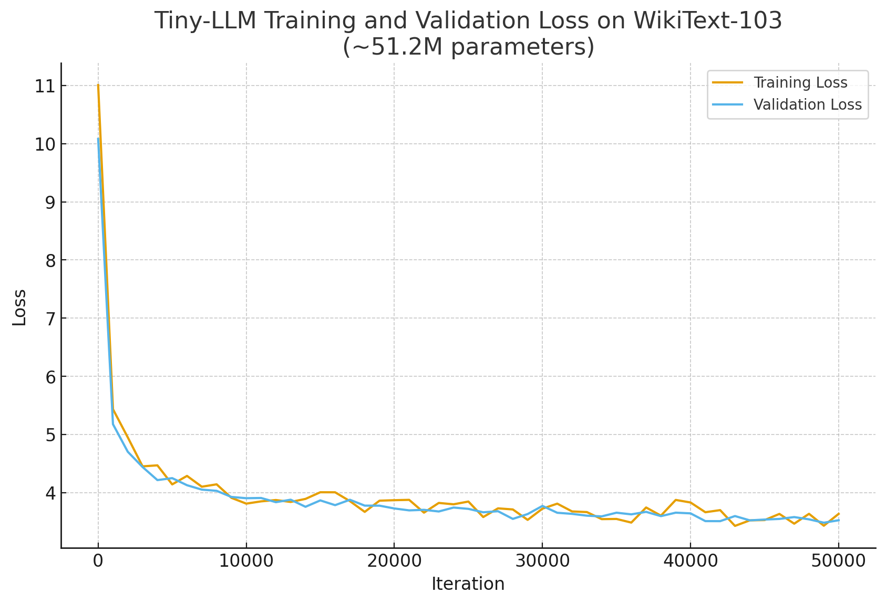

# Tiny-LLM

This project implements a minimal Large Language Model (LLM) using PyTorch. It includes a complete training pipeline with custom tokenization, transformer architecture, and text generation.

## Results

With ~51.2M parameters, we converge to a validation loss of 3.5 and perplexity of 34 on WikiText-103 after 50,000 iterations.

<div align="center">

</div>

Example of generated text:

> World War II was a global conflict of interest since it did not have the support of many major political parties such as the National Socialist Workers' Union for Germany, the Social Workers' Union for the United Nations and the United Nations, and the Warsaw Pact. The war was the setting for the war and the installation of a national election. The war was not resolved until the end of World War II, when the Soviet Union had already begun to face a crisis.
>
> = = = Critical reception = = =
> 
> After the war, the Navy adopted the National Guard as its Director of Naval Artillery. It was replaced by the Army of the Navy's Navy, and was reduced to a Navy Reserve Training class, a naval career in the Navy Reserve. In 1946, the Navy was renamed the Navy Reserve Service Medal, with the Navy's rank of major. She was reclassified as a ship on 1 July 1947, and was renamed to the Navy Reserve Service Medal. In 1949, she was converted into a storage hulk for the Navy's Army Reserve Fleet, and renamed to the Naval Reserve Fleet. She was converted into an aircraft carrier in 1950.

## Architecture

The model implements a standard decoder-only transformer architecture ([`src/core/model.py`](src/core/model.py)):

```
1. Token + Positional Embeddings (512d)
2. Dropout (0.1)
3. Transformer Blocks (x8):
   a. LayerNorm → Multi-Head Attention (8 heads) → Residual
   b. LayerNorm → Feed Forward (2048d) → GELU → Residual
4. Final LayerNorm
5. Linear Projection (512d → vocab_size)
```

### Key Implementation Details

- **Attention Mechanism**: Multi-head scaled dot-product attention with causal masking
- **Normalization**: Pre-norm architecture using LayerNorm before attention and feed-forward blocks
- **Activation**: GELU activation functions in feed-forward networks
- **Position Encoding**: Learnable positional embeddings up to context length

## Training Pipeline

### Dataset Processing

The system uses WikiText-103 with preprocessing in [`src/core/dataset.py`](src/core/dataset.py):

1. **Tokenization**: GPT-2 BPE encoding via tiktoken
2. **Chunking**: Sequences grouped into 512-token blocks
3. **Splitting**: 99%/1% train/validation split with shuffling

### Training Configuration

```python
TrainingConfig(
    max_iterations=100000,
    betas=(0.9, 0.95),           # AdamW optimizer
    max_learning_rate=6e-4,
    min_learning_rate=6e-5,      # Cosine annealing schedule
    gradient_accumulation_steps=4,
    max_gradient_norm=1.0,
    weight_decay=0.1
)
```

### Optimization Features

- **Mixed Precision**: Automatic mixed precision with bfloat16
- **Gradient Scaling**: CUDA gradient scaler for numerical stability
- **Learning Rate Scheduling**: Cosine annealing from max to min learning rate
- **Gradient Clipping**: Global norm clipping at 1.0 to prevent gradient explosion
- **Model Compilation**: PyTorch 2.0 compilation for inference acceleration

## Installation and Usage

### Setup

```bash
git clone https://github.com/RobinLmn/tiny-llm
cd tiny-llm
pip install -r requirements.txt
```

### Training

```bash
python [src/main.py](src/main.py)
```

The training script automatically handles dataset download, tokenization, and model checkpointing every 5,000 iterations to `models/tiny/`.

### Inference

```python
from core.utils import load_model
from core.tokenizer import SubWordTokenizer
from core.generation import GenerationConfig, generate_text

# Load trained checkpoint
tokenizer = SubWordTokenizer("gpt2")
model = load_model(model_config, tokenizer, "models/tiny/tiny-llm.pth")

# Generate text with temperature sampling
config = GenerationConfig(maximum_length=200, temperature=0.8)
text = generate_text(model, tokenizer, "World War II was", config)
```

## Dependencies

- PyTorch >= 2.0.0 (required for scaled_dot_product_attention)
- tiktoken (GPT-2 tokenizer)
- datasets (HuggingFace data loading)
- rich (progress visualization)

## License

See [LICENSE](LICENSE) for details. Inspired by [nanoGPT](https://github.com/karpathy/nanoGPT) by Andrej Karpathy. Check his work for more details and examples!
